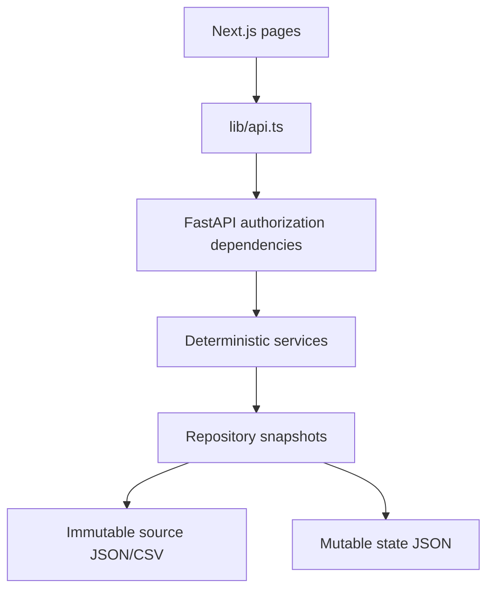

# Architecture

## Request flow



Route handlers parse HTTP and delegate. The principal comes from a server-owned development token mapping. Employees can read/complete only their own data; HR can inspect and import, but cannot complete on another employee's behalf. Replace identity lookup for production; keep the principal and dependency boundary.

The dataset service owns one published snapshot and one mutation lock. Repositories own IO. A mutation reads current state under the lock, builds and validates the full candidate snapshot, writes a sibling temporary file, flushes/fsyncs, atomically replaces state.json, then publishes the prepared snapshot. Failed persistence does not publish partial state. There is exactly one backend process; no journal, background worker or generalized transaction subsystem.

Raw skills remain the last assessment. Current skills are projected from post-assessment completions. Source participation rows and runtime completion transitions remain distinct; effective history merges them once. Receipts and completions persist together. Retried commands return the original result even after restart.

## Module boundaries

- schemas: real source envelopes and fields, separate derived responses and overlay records.
- repositories: decoding, source fingerprints, indexed lookup, atomic file replacement.
- services: progress/gaps/trajectory/eligibility, command policy, import validation and HR aggregates.
- api: authorization, request/response adaptation and bounded upload handling.
- ai: disabled provider protocol and validation of future selected events/evidence.
- frontend/lib: single API client and DTO types; components never own backend URLs.

Private frontend state is keyed by the in-memory token. Changing identity unmounts private screens; requests abort on unmount and late mutation responses are discarded. No credentials are stored in localStorage.

## Future recommendation flow

```text
current employee state
 -> next-grade / career-goal analyses
 -> eligible activities
 -> deterministic evidence
 -> multi-factor scoring (next milestone)
 -> LLM refinement (next milestone)
 -> validated 1–3 recommendations + evidence-backed explanation
```

RecommendationCandidate retains current/target grades, current/required skill levels, critical flags, capped attainable gains, completed-history references, no-show/decline/drop counts and references, availability and duration/format. score is null. Output validation requires eligible unique IDs and at least three distinct supported evidence kinds. It also checks employee, snapshot revision and date. Numeric state remains deterministic; structured validation alone does not prove free-form model prose truthful.

There are no model calls or SDK dependencies in the foundation. The recommendation endpoint returns 501. HR candidate coverage is available; actual recommendation coverage remains null until recommendations exist.

## Reproducibility

Compose runs a Next standalone image and one Uvicorn worker. Raw source is mounted read-only; overlay is a named volume. The browser API URL is a frontend build argument. Public demo credentials and loopback binding support a local hackathon demo, not production authentication.

See the approved spec and plan under superpowers/. See handoff.md for measured verification and remaining limitations.
